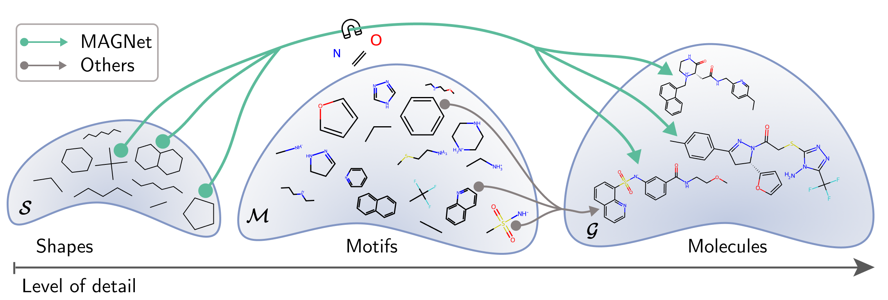

# MAGNet: Motif-Agnostic Generation of Molecules from Shapes
Recent advances in machine learning for molecules exhibit great potential for facilitating drug discovery from in silico predictions. Most models for molecule generation rely on the decomposition of molecules into frequently occurring substructures (motifs), from which they generate novel compounds. While motif representations greatly aid in learning molecular distributions, such methods struggle to represent substructures beyond their known motif set. To alleviate this issue and increase flexibility across datasets, we propose MAGNet, a graph-based model that generates abstract shapes before allocating atom and bond types. To this end, we introduce a novel factorisation of the molecules' data distribution that accounts for the molecules' global context and facilitates learning adequate assignments of atoms and bonds onto shapes. Despite the added complexity of shape abstractions, MAGNet outperforms most other graph-based approaches on standard benchmarks. Importantly, we demonstrate that MAGNet's improved expressivity leads to molecules with more topologically distinct structures and, at the same time, diverse atom and bond assignments. 



If you use this repository for your research, please cite:
```
@article{hetzel2023magnet,
  title={MAGNet: Motif-Agnostic Generation of Molecules from Shapes},
  author={Hetzel, Leon and Sommer, Johanna and Rieck, Bastian and Theis, Fabian and G{\"u}nnemann, Stephan},
  journal={arXiv preprint arXiv:2305.19303},
  year={2023}
}
```


# Molecule Generation Baselines
Besides the MAGNet code, we provide the same interface, package structure and conda environment for all evaluated baselines in hopes of facilitating ease of reproducibility.

Supported Molecule Generation Models:
- [✨ MAGNET ✨](https://arxiv.org/abs/2305.19303)
- [SMILES-LSTM](https://arxiv.org/abs/1701.01329)
- [CHARVAE](https://arxiv.org/pdf/1610.02415.pdf) (without Terminal GRU)
- [JTVAE](https://arxiv.org/abs/1802.04364)
- [HIERVAE](https://arxiv.org/pdf/2002.03230.pdf)
- [PSVAE](https://arxiv.org/abs/2106.15098)
- [MOLER](https://arxiv.org/abs/2103.03864)
- [GRAPHAF](https://proceedings.neurips.cc/paper_files/paper/2018/file/d60678e8f2ba9c540798ebbde31177e8-Paper.pdf)
- [GCPN](https://arxiv.org/pdf/2001.09382.pdf)

This repository does not reimplement the models but only provides a wrapper / unified interface to access them. We would thus like to thank the authors of the aforementioned papers for making their code public.

## Setup

As a first step, please create the conda environment with
```
mamba env create -f config/env.yaml
conda activate baselines
pip install -e .
```

Currently, there are severe problems with installing `torchdyn`. For the time being, you can do this via
```
pip install -c config/constraints.txt git+https://github.com/DiffEqML/torchdyn.git
```

Either you have cloned the repository with the command `git clone xyz --recurse-submodules` and have the code for required resources, or you can get neccessary repositories by interating through the `resources/` folder with the commands 
```
git submodule init
git submodule update
pip install -e .
```

Further, please adjust the path configuration at  `baselines/global_utils.py` according to your file structure as well as W&B config.

## General Structure

We have currently structured the repository s.t. wrappers exist for the individual baselines. We provide the following functionality:

**Preprocessing**:
Before running any training or inference, you should execute `experiments/preprocessing.py` for any models you would like to work with. In case no ZINC smiles files are provided, this will download and store them autmatically and then extract a vocabulary and preprocess datapoints where neccessary.

**Training**: 
After running the preprocessing, you can start training with default hyperparameters for ZINC with `experiments/training.py`. Where possible, this will log metrics to Weights&Biases and save checkpoints of the trained models.

**Reconstruction**: 
With the file `experiments/reconstruction.py`, you can perform reconstruction on a given set of SMILES.

**GuacaMol Distribution Learning Benchmarks**:
`experiments/guacamol_distribution.py` executes the distribution learning benchmarks for any trained model by sampling a sufficient amount of molecules and evaluating them.

**GuacaMol Goal-Directed Benchmark**: 
`experiments/guacamol_goal_directed.py` executes the goal-directed benchmarks for models that were not previously trained for any optimization task. This can be done either via MSO or gradient ascent, please refer to the script's arguments for more details and hyperparameters. Please note that the hyperparameters provided for defaults are intended for debugging, to conduct the benchmark properly these have to be adjusted (e.g. the number of MSO steps would have to be increased).

**Interpolation**: 
`experiments/interpolation.ipynb` performs interpolation in the latent space as well as plotting of the trajectories.
